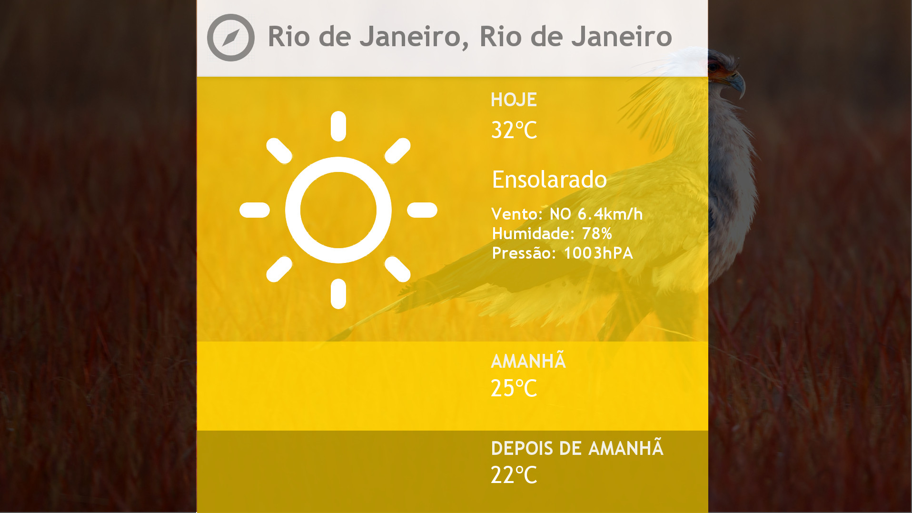
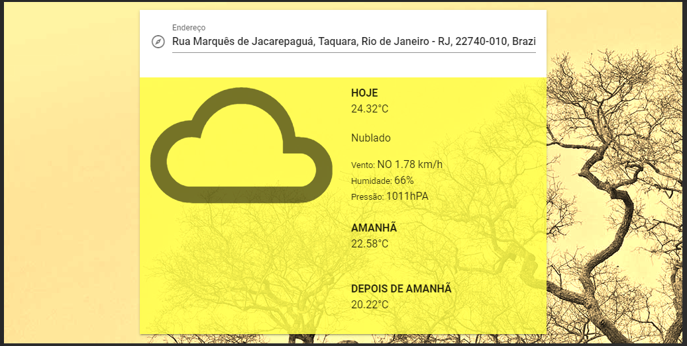

# weather-app 🌥

## Indices 🧭

- [Description](#description-)
- [Project setup](#project-setup-)
- [Commands](#commands-)
- [Setup the backend](#setup-the-backend-)
- [Final thoughts](#final-thoughts-)

## Description ☀
Weather app is a micro site developed for the charlie challenge, from Hurb.

The idea is that you can see the weather from any location, just typing it or allowing to show your current position.

## Project setup ☂

>Dependencies

This project will need [Docker](https://www.docker.com/) or [node](https://nodejs.org/)!

### Docker ☁

> Steps with docker

```shell script
docker-compose build
```

```shell script
docker-compose up
```

### Compiles and hot-reloads for development 🌧

> Steps with node

```shell script
npm install
```

```shell script
npm run serve
```

### Compiles and minifies for production ❄

```shell script
docker-compose build
```

## Commands 🌪

### Run your unit tests 🌡
```
npm run test:unit
```

### Lints and fixes files 🌩
```
npm run lint
```

## Setup the backend 🌨

In case you want to run the backend only 

> In `express/` runs
```shell script
npm install
```

then

```shell script
npm run start
```

### Endpoints 🌫

To get the image for today
```
http://localhost:3000/image
```

To get the name and coordinates from a location, provides a location name, or the coordinates
```
http://localhost:3000/geocode?location={{location_name}}
```

To get the weather from a location, provides a location name 
```
http://localhost:3000/weather?location={{location_name}}
```

## Final thoughts ☃

The challenge proposes this UI:



I make a feel changes in the UI, most for improve the UX, I use an UI plugin called _Vuetify_ to focus more on the functionalities and less in the UI. 

Some colors gain more contrast, and the icons are in a pattern used by google ( Material Design )

And it looks like this:



For the challenge, i made a _express_ backend api to fetch the requested endpoints. This helps me allot to deal with the data in the project, and takes away the dependence of the app from third party apis.

Was a really exiting project! Simple, at first, but have some complexity when you look for the possibilities, the complexity goes on! 

First time creating an express server, give some maintenance in the past, but never created one from scratch. Same thing for Docker! I already made some dockers to python project, but never for an Express, nor a Vue project. A wonderful experience!

Have a chance to take a look in tests with jest in Vue components, something I would like to know better... Could not resolve the warning from the UI plugin Vuetify,
is nothing so critical, don't mess up with the tests, but is something that I could think to improve.
